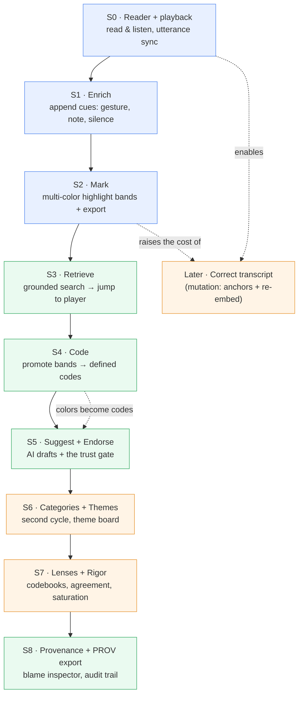
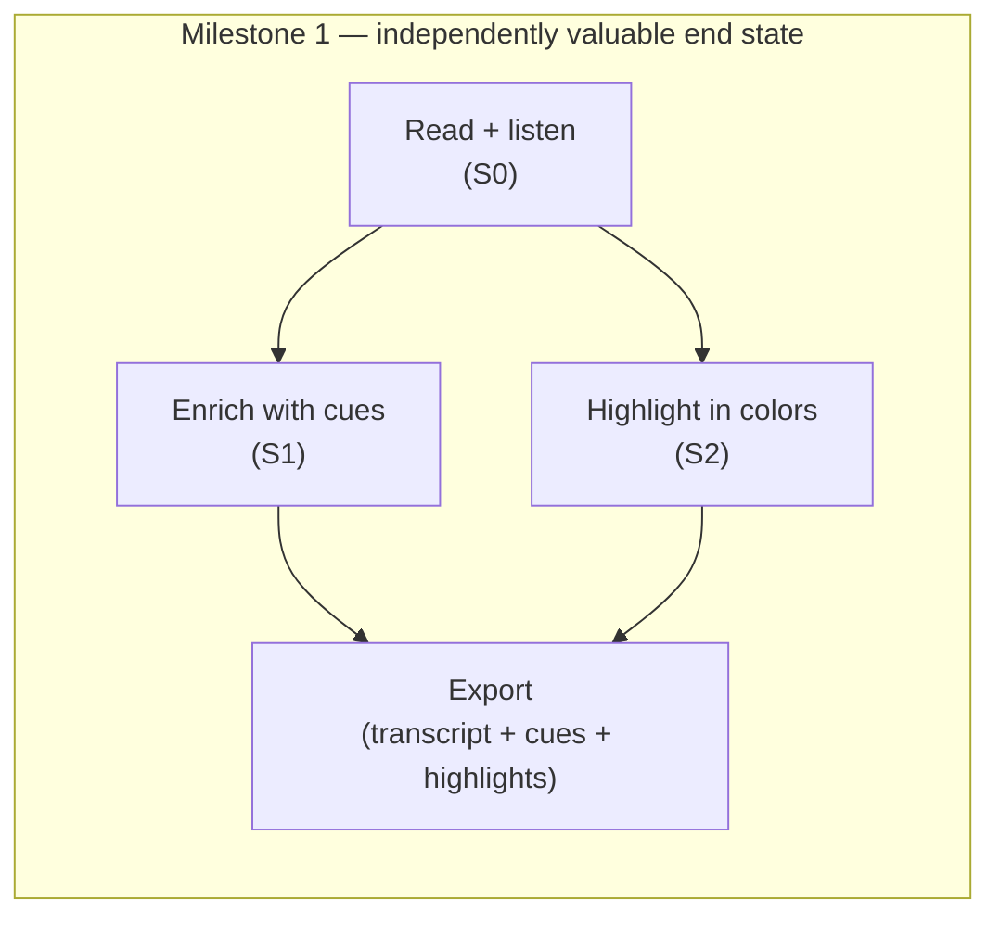
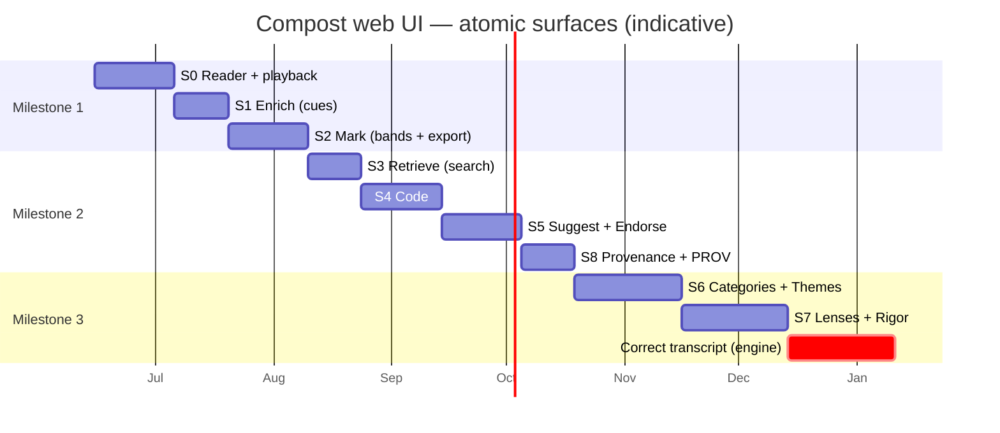

# Compost — Atomic Surface Roadmap (web UI)

*A milestone roadmap for shipping the Compost web UI as a sequence of atomic surfaces — each independently valuable, each buildable in weekly increments, sequenced so the hard problems arrive only after the data model has been felt with real use.*

**Status:** draft for review · **Cadence assumption:** side project, ~weekly shippable increments · **Companion to:** [`ux-journey-and-ia.md`](ux-journey-and-ia.md) (the journey/IA brief) · **Phasing:** maps to that brief's M1 / M2 / M3.

---

## 0. What "atomic surface" means here

A surface qualifies as *atomic* when it satisfies four tests. The roadmap is ordered to keep early surfaces scoring well on all four:

1. **Valuable alone.** A researcher gets real use from it even if nothing after it ever ships.
2. **Backend-ready (preferably).** It wraps engine capability that already exists, so the week's work is a client, not a new subsystem. Where it isn't, that's called out as *engine work* — a yellow flag for a side project.
3. **Append-only first.** It adds events to the canonical filesystem/event log rather than mutating canonical data. Mutation (transcript correction) is deferred and designed deliberately, because it's where anchor-drift and re-indexing bite.
4. **Dogfoodable.** You can use it on the bocashi / Haraway material the same week you ship it, and become your own first user.

The guiding sequence decision: **read → enrich → mark → retrieve → code → suggest+endorse → synthesize.** (Analytic memos — the researcher's running interpretive record, ADR 0004 — thread through the *synthesize* arc rather than occupying a rung of their own.) Reading and enriching are cheap and on-model; correction and AI are deferred until the model is proven.

---

## 1. The finding that shapes the early rungs

A check of the transcript schema (`schema/transcript.schema.json`, `cli/src/lib/transcript.ts`) established two facts that set the order of S0–S2:

- **Timing is at least utterance-level, and word-level where present.** Transcript = `{ session, utterances: [{ speaker, text, start_ms, end_ms, words? }] }`; each utterance carries an *optional* `words[]` array (`{ w, s, e, conf? }`), so per-word timing exists in the schema today (`schema/transcript.schema.json`, `cli/src/lib/transcript.ts`) — it may simply be unpopulated in a given transcript. Utterance-level sync is the guaranteed floor; word-level sync is available wherever `words[]` is filled.
- **Cues are a time-anchored, append-only layer inside the transcript.** `transcript.json` carries a `cues[]` array (alongside `silences[]` and `frames[]`) of events like `{ id, kind: "emphasis", start_ms, end_ms, source }`. The transcriber writes these; a human can append to the same array.

Two consequences drive the roadmap:

| Anchor type | Used by | Survives a text correction? | Roadmap consequence |
|---|---|---|---|
| **Time `start_ms`** | Cues (enrichment) | ✅ Yes | Enrichment is safe to ship **before** correction |
| **Utterance + char span** | Highlights | ❌ No (drift) | Highlights make correction hard → correction is its own milestone |

And: **"current word lights up" (Descript) is not free, but it isn't blocked either** — the schema already carries optional per-word timings (`words[]`), so "current *word* lights up" works wherever they're populated, with "current *utterance* lights up" as the guaranteed floor. Word-level sync is a rendering choice, not a schema change, and must not block S0.

---

## 2. The ladder at a glance



Blue = Milestone 1 (next) · Green = Milestone 2 · Amber = Milestone 3 / Later.

| Surface | Value alone | Backend | Anchor model | Phase |
|---|---|---|---|---|
| **S0 Reader + playback** | Review interviews with rich cues + audio sync | ✅ ready (`session`) | read-only | M1 |
| **S1 Enrich** | Add gestures/notes/silences — transcription-as-analysis | ✅ ready (cues stream, append) | time `t` | M1 |
| **S2 Mark** | Multi-color highlighting + export (close reading) | ✅ ready (`create highlight`, `export`) | utterance+span | M1 |
| **S3 Retrieve** | Find passages fast, jump to them | ✅ ready (`search`) | n/a | M2 |
| **S4 Code** | First real coding; bands become defined codes | ✅ ready (`create code`) | evidence refs | M2 |
| **S5 Suggest + Endorse** | The differentiator: AI drafts, human endorses | ✅ ready (`code`/`tag`/`endorse`/`blame`) | n/a | M2 |
| **S6 Categories + Themes + Memos** | Second-cycle synthesis + analytic memos | ✅ ready (`category`, `create theme`, `memo`) | `{code\|category\|memo}` | M3 |
| **S7 Lenses + Rigor** | Multiplicity, κ/α, saturation | ✅ ready (`codebook`, `agreement`, `saturate`) | per-frame | M3 |
| **S8 Provenance + PROV** | Audit trail, reproducibility | ✅ ready (`blame`, `export --format prov`) | event log | M2/M3 |
| **Later Correct** | Trustworthy ground truth | ⚠️ **engine work** (no `edit` verb; re-embed; anchor migration) | mutates tokens | Later |

The happy headline: **every surface except correction wraps capability the engine already has.** The web UI is overwhelmingly a client-building exercise — ideal for a weekly side-project cadence.

---

## 3. Milestone 1 — read, enrich, mark (the shippable core)

Three atomic surfaces. Together they make Compost a tool you'd reach for to *read your interviews properly, annotate them with the richness ASR misses, and mark what matters* — a complete, honest product before a single code or AI suggestion exists. Its identity is **"read your interviews the way they actually sounded, and mark them,"** and its differentiator is transcript richness, not AI.



### S0 · Reader + playback

**Value alone:** open a session and read it with speakers, typed cues (laughter, pause, emphasis, overlap) rendered legibly, audio playing with the current *utterance* tracked and click-to-seek. Even with zero authoring, this is a better interview-review experience than scrubbing a media file.

Weekly increments:

1. Render `transcript.json` — speaker turns, utterance text, timestamps; readable typography.
2. Overlay the transcript's `cues[]` inline at their timestamps (silences, laughter, prosody) without turning the page into noise.
3. Audio/video element + play/pause/seek; click an utterance to seek the media to its timestamp.
4. Playback follows along: the current utterance highlights as audio plays (utterance-level as the floor; word-level wherever `words[]` is populated).
5. Frame index (the transcript's `frames[]`) shown for video sessions; click a still to seek.

Done criteria: a researcher can read and listen to a full bocashi session, with cues visible and click-to-seek working, and never touch the CLI.

Watch-outs: word-level sync is a nice-to-have here, not a blocker (render it only where `words[]` exists); keep cue rendering scannable, not cluttered; large media files — stream, don't load whole.

### S1 · Enrich (append descriptive cues)

**Value alone:** this is the surface your Saldaña instinct points at. A researcher listening notices what ASR missed — a sarcastic tone, a gesture, a meaningful silence, an aside — and **adds a cue** at that timestamp (`note`, `gesture`, plus the existing `pause`/`emphasis`/`laughter`/`overlap` types). Methodologically this is transcription-as-theory (Ochs 1979): deciding what to represent *is* the first analytic act. Technically it's an append to the existing time-anchored cue stream — cheap, on-model, and robust to later text correction.

Weekly increments:

1. Add a cue at the current playhead (pick type, optional text/speaker) → append to the transcript's `cues[]`.
2. Edit/remove a *human-authored* cue (append-only correction of your own annotation).
3. Distinguish **agent-detected** cues from **researcher-added** ones visually (the three-actor model applies to cues too).
4. Cue list / filter by type; jump-to-cue seeks the player.

Done criteria: a researcher can enrich a session with gestures and notes that survive in the transcript's `cues[]`, visibly attributed to them rather than the ASR.

Watch-outs: keep researcher vs. agent provenance distinct from day one; don't let enrichment mutate ASR-authored cues (append a corrective cue instead).

### S2 · Mark (multi-color highlight bands + export)

**Value alone:** close reading — drag-select a span, create a highlight, organize by color. Per the earlier discussion, treat each **color as a renamable "band"** (an optional lightweight label), not a bare swatch — so a band has a clean upgrade path to becoming a code at S4. Ship export immediately (engine does CSV/MD/EAF): getting highlights *out* is Taguette's core trust signal and costs you nothing.

Weekly increments:

1. Drag-select a span in an utterance → `create highlight` (anchored `utterance + span`).
2. Highlights list; click to jump back to the player at the exact utterance.
3. Multi-color **bands** with a small legend; assign a highlight to a band; rename a band.
4. Export — highlights + bands + transcript to CSV/MD; EAF for ELAN users.

Done criteria: a researcher can highlight a session in several named colors and export the result to open elsewhere.

Watch-outs: bands are proto-codes — design them so S4 can promote a band into a code without data migration; remember these anchors are span-based and therefore the reason correction is deferred.

---

## 4. Milestone 2 — retrieve, code, and the trust gate

Where Compost stops being a nice reader and becomes a coding tool with its distinctive provenance model.

### S3 · Retrieve (grounded search)
Read-only hybrid search (`compost search`) over the corpus; results deep-link into the player. Find-then-highlight closes a loop with S2. Backend ready; pure client. *(Grounded chat with validated citations can ride in here or wait — chat is `compost chat`, M2/M3.)*

### S4 · Code (first real coding)
Author a code with a definition and evidence (`compost create code`), and **promote a S2 band into a code** in one step. This is the first surface that asks for *definitions* — the move from informal color to accountable category. Evidence links point back to highlights in the player.

### S5 · Suggest + Endorse (the differentiator finally lands)
AI proposes codes/glossary as `[draft]` (`compost code`, `compost tag`); the researcher reviews lineage (`compost blame`) and endorses (`compost endorse`). This is the keystone interaction from the design brief: nothing AI-authored reaches an export without a human endorsement. It arrives at S5 — *after* there's real coding to assist — rather than first, which keeps M1 free of model dependencies.

```mermaid
sequenceDiagram
    actor R as 🧑 Researcher
    participant UI as Web UI
    participant AI as 🤖 AI
    participant AG as ⚙️ Agent
    R->>UI: "Suggest codes from my highlights"
    UI->>AI: compost code / tag
    AI-->>UI: Draft codes/terms [draft]
    R->>UI: Inspect lineage, then endorse
    UI->>AG: compost blame → compost endorse
    AG-->>R: Promoted; now enters exports
```

### S8 · Provenance + PROV export
Can land in M2 alongside S5 (the blame inspector is what makes endorsement legible) or in M3. `compost blame` as an inspector; `export --format prov` as the reproducibility deliverable.

---

## 5. Milestone 3 — second cycle, multiplicity, and (finally) correction

- **S6 · Categories + Themes + Memos** — second-cycle grouping (`category`) and the theme board (`create theme`, including cross-lens themes as boundary objects). A theme's evidence set is heterogeneous — `{code | category | memo}` — so **analytic memos** ([ADR 0004](adr/0004-analytic-memos.md); `compost memo`) are both first-class evidence here and themselves a coding target. The backend is ready (`memo` on CLI + MCP), so it's a client-only surface like the rest.
- **S7 · Lenses + Rigor** — declare interpretive lenses (`codebook new`), measure agreement (κ/α) and saturation *per frame*. Persistent "which lens am I in?" indicator.
- **Later · Correct transcript** — the one surface that needs engine work and breaks the append-only invariant. Schedule it deliberately, with: a `compost edit`-style verb (a tracked before/after event, not a silent overwrite), **anchor migration** for span-based highlights, and a **re-embed/reindex** hook so search and grounding don't drift off corrected text. By the time you build it you'll have lived in the data model for months — which is exactly the point of deferring it.

---

## 6. Roadmap timeline (indicative, weekly cadence)

A side-project pace; weeks are relative, not committed dates. Each surface is several weekly increments.



---

## 7. Open decisions

1. **Word-level timing — resolved at the schema.** The transcript schema already defines an optional per-utterance `words[]` array (`schema/transcript.schema.json`, `cli/src/lib/transcript.ts`), so word-sync needs no schema change — only a transcript that populates it. The remaining question is operational: confirm the ASR worker actually emits `words[]`, and decide whether word-sync is worth the render cost over utterance-level.
2. **Band ↔ code mapping.** Confirm S2 bands are modeled so S4 promotion is migration-free (a band carries a stable id that a code can adopt). Decide now; it's cheap now and expensive later.
3. **New cue types — mostly a UI question.** The schema already allows an arbitrary cue `kind` plus a free-text `annotation`, so `note`/`gesture` need no schema/validator change. The open question is only the UI vocabulary and validation policy for human-authored cues.
4. **Does chat ride with S3 or wait?** Grounded chat is higher-wow but higher-risk (citation UI, "insufficient evidence" state). Bundle with search, or hold for its own rung?
5. **When does S8 land?** Provenance inspector is most useful *with* the endorsement gate (S5). Pull it into M2, or keep M2 lean and ship it in M3?
6. **Correction scope when it comes.** Full token editing, or a narrower "fix this word / merge these utterances / re-label speaker" set that covers 90% of real corrections with less anchor-migration surface?

---

## 8. Sources

Schema findings: `schema/transcript.schema.json` and `cli/src/lib/transcript.ts` — the canonical transcript types (utterances with optional `words[]`; embedded `cues[]` / `silences[]` / `frames[]`). CLI semantics from `cli/src/commands/` (and the external GitHub wiki).

Comparable surfaces: Descript (audio-synced transcript editing) — concept reference; [Taguette](https://www.taguette.org/getting-started.html) (highlight→tag→export, exportability as trust); [Dovetail](https://www.producthunt.com/products/dovetail) (transcript-media sync); [Delve](https://delvetool.com/blog/coding-reliability-thematic-analysis) (blind/compare coding).

Methodology: Elinor Ochs, "Transcription as Theory" (1979) — enrichment as the first interpretive act; Johnny Saldaña, *The Coding Manual for Qualitative Researchers* — pre-coding, first/second cycle; Lucy Suchman, *Plans and Situated Actions* — the endorsement gate. Full grounding in [`reading-list.md`](reading-list.md).
