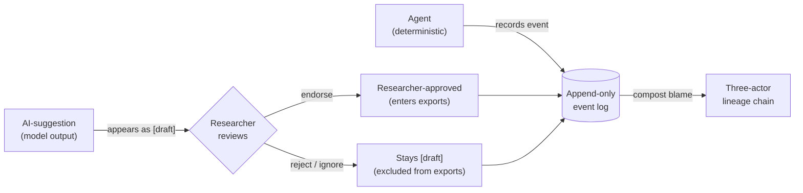
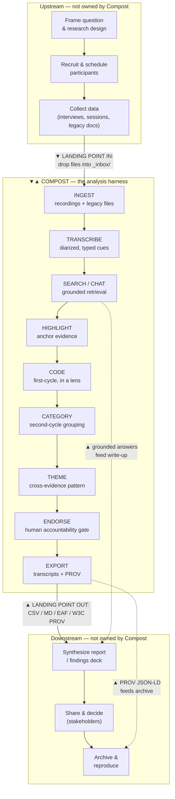
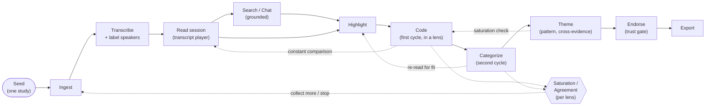
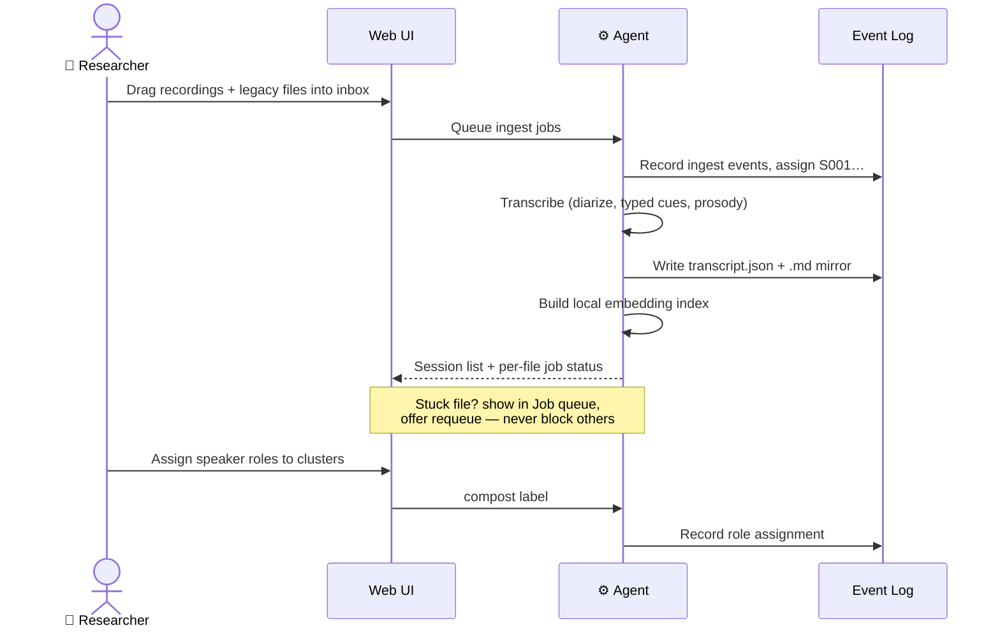
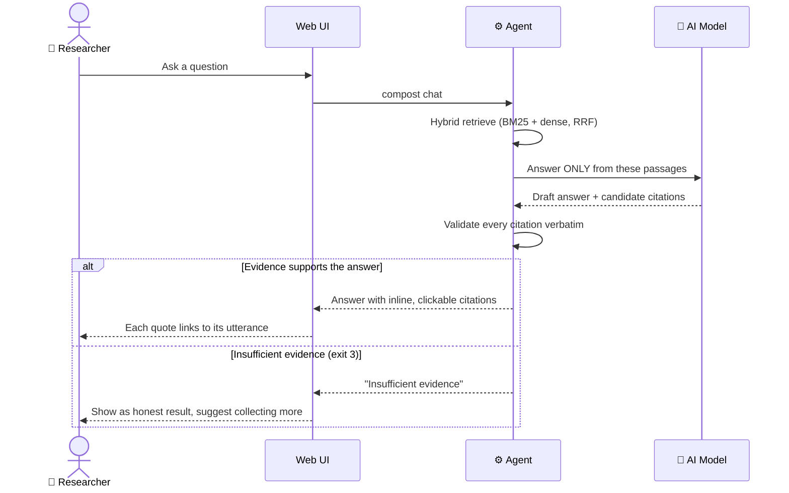
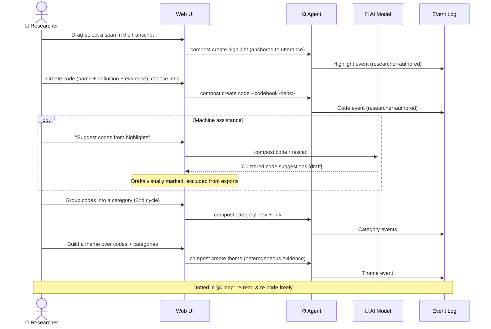
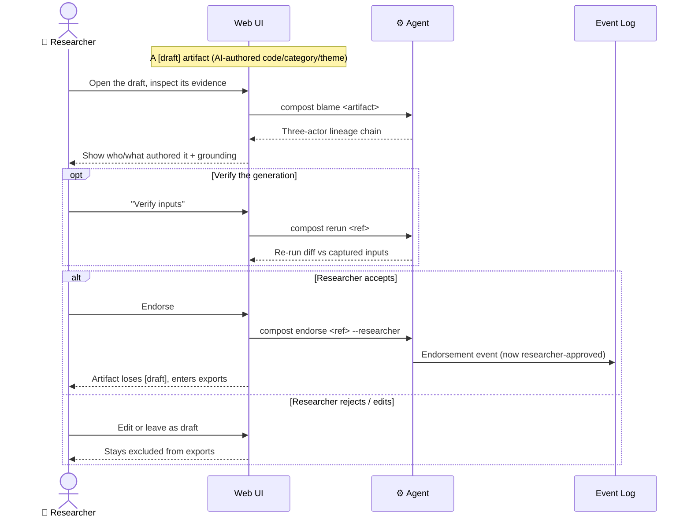
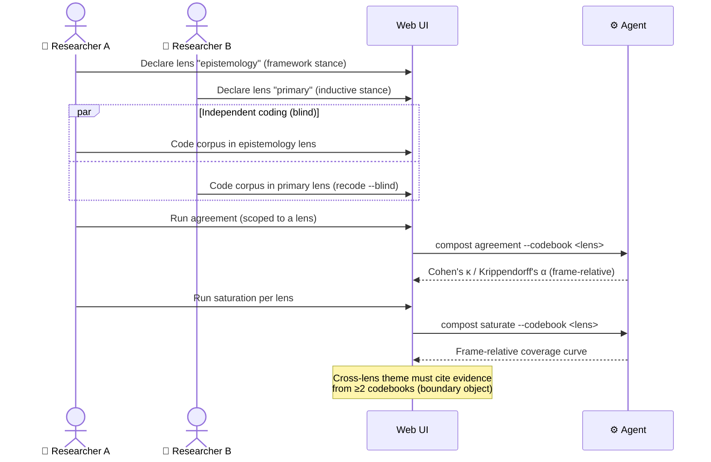
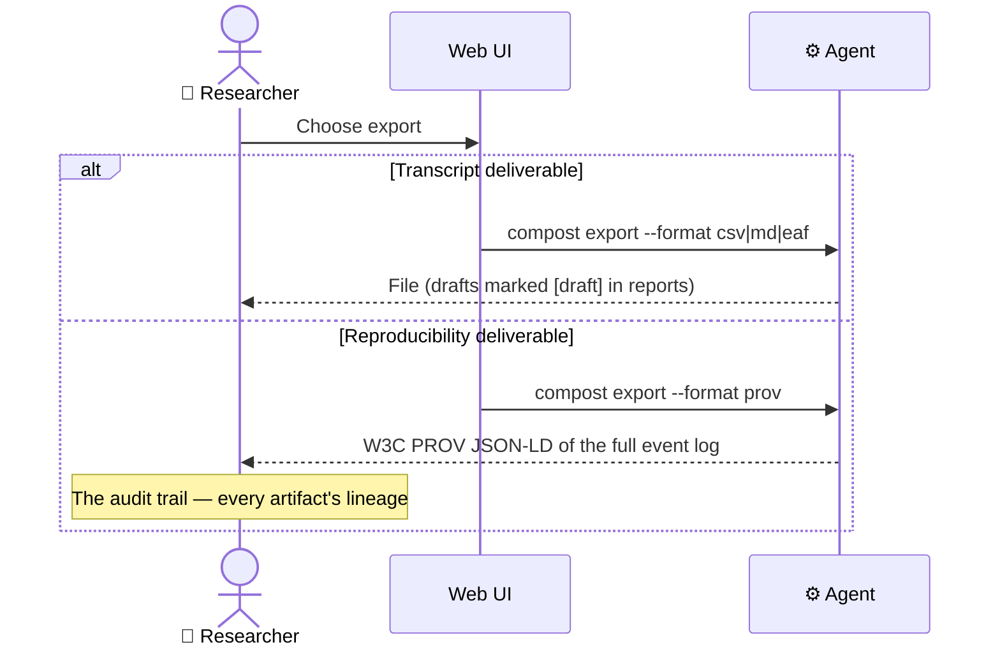
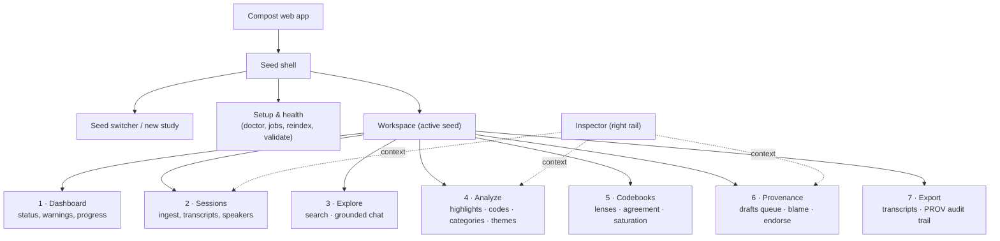

# Compost — Research Journey, Task Mapping & Information Architecture

*A pre-UX/UI design brief. Maps the qualitative research journey, locates where Compost helps and where work lands, assigns every task to a human or agentic solution, and proposes an information architecture and flow set for the forthcoming web UI.*

**Status:** draft for review · **Scope target:** full web app, phased to the web-UI milestone · **Companion to:** `wiki/Usage-Guide.md`, [`adr/0001-codebook-multiplicity.md`](adr/0001-codebook-multiplicity.md), [`adr/0002-category-tier.md`](adr/0002-category-tier.md), [`adr/0004-analytic-memos.md`](adr/0004-analytic-memos.md), [`adr/0006-ingest-provenance.md`](adr/0006-ingest-provenance.md)

---

## 0. How to read this document

This is the map you make *before* you draw a single screen. It does four things, in order:

1. **Frames the journey** — the whole qualitative research lifecycle, so we can see Compost in context rather than designing in a vacuum.
2. **Locates Compost** — where it plugs in, what it owns end-to-end, and its *landing points*: the handoffs where work arrives from elsewhere and where it leaves for elsewhere.
3. **Maps every task to a solver** — human (researcher judgment), agentic (deterministic software), or AI-suggestion (model output, untrusted) — and aligns those into swimlanes so the UI can make the division of labor legible.
4. **Proposes an IA and flow set** — a navigation structure and a library of Mermaid flow/swimlane diagrams, phased so the next milestone is buildable without painting us into a corner.

Diagrams are Mermaid; they render in GitHub, VS Code, and most Markdown viewers. Every flow is annotated with the CLI verb(s) it wraps, so the UI is never inventing capability the engine doesn't already have.

A guiding principle, drawn straight from the project's own reading list: this tool's job is interpretation, and *interpretation can be a kind of violence done to the work* (Sontag). The UX's central responsibility is therefore not speed — it is keeping the human accountable and the machine's suggestions visibly provisional. Suchman's *Plans and Situated Actions* is the theory behind the endorsement gate; the UI is where that gate becomes felt.

---

## 1. Scope

### In scope

- The **full qualitative research lifecycle** as a context frame, with Compost's landing points marked.
- **Compost's core analysis loop** in full task detail: ingest → transcribe → search → highlight → code → category → theme → endorse → export, plus codebooks (lenses), agreement, saturation, and provenance/blame.
- A **web application IA** covering every current CLI verb, phased into *Milestone 1 (next)*, *Milestone 2*, and *Later*.
- **Human vs. agentic task assignment** for every task, rendered as swimlanes.
- **UX/UI considerations** specific to a local-first, provenance-first, AI-assisted tool.

### Out of scope (named so they aren't silently assumed)

- Visual design, component library, color, type. This is structure and behavior only.
- Recruitment, scheduling, incentives, consent logistics — Compost does not touch participant management; these appear in the lifecycle frame only as *upstream landing points*.
- Real-time multi-user collaboration and auth. Compost is local-first and single-machine today; the IA leaves room for it but Milestone 1 assumes one researcher on one machine.
- The stubbed `query` and `synthesize` verbs are treated as *future surfaces*, sketched but not detailed.

### The orienting constraint

Compost is **local-first and agent-native**. The filesystem is canonical; every operation is a CLI verb emitting JSON; the same engine is exposed as Claude Code commands and MCP tools. The web UI is therefore *another client over the same engine* — not a new source of truth. This single fact drives most of the IA and nearly all of the UX considerations below.

---

## 2. The three actors (the spine of every swimlane)

Compost's provenance model is not a feature bolted onto the side — it is the organizing logic of the entire experience. Three actors touch a seed, and the UI must keep them visually distinct at all times.

| Actor | Who/what | Trust | UI treatment |
|---|---|---|---|
| **Researcher** | A human, *accountable* for the analysis | Authoritative | Endorsed artifacts; the only actor who can promote a draft |
| **Agent** | Deterministic software (the harness, watchers, indexers) | Trusted-as-mechanism | System actions; transparent, logged, reproducible |
| **AI-suggestion** | Model output (codes, categories, glossary, chat answers) | **Untrusted until endorsed** | Always `[draft]`; visually marked provisional; never in exports until endorsed |

Every later swimlane uses these three (plus the **Filesystem / Event log** as a system-of-record lane) as its lanes. The endorsement gate — the moment an AI-suggestion becomes researcher-owned — is the single most important interaction in the product.



---

## 3. The research lifecycle frame & Compost's landing points

Compost owns the **analysis** stage. But analysis arrives from somewhere and departs to somewhere, and a tool that ignores its seams designs bad seams. The frame below shows the whole lifecycle; the highlighted band is what Compost owns; the **landing points** (▼ in, ▲ out) are the handoffs the UI must handle gracefully.



### The landing points, named

| # | Landing point | Direction | What crosses the seam | UI implication |
|---|---|---|---|---|
| L1 | **Inbox drop** | In | Recordings (audio/video) + legacy docs (PDF, DOCX, PPTX, CSV, XLSX, TXT) | Drag-and-drop zone; show queue + per-file job status; never block on a stuck file |
| L2 | **Existing transcript import** | In | Already-transcribed text and `.vtt`/`.srt` captions (`compost import`, #323) | "I already have a transcript" path that skips ASR |
| L3 | **Cross-study lens reuse** | In | A validated codebook from another seed (`codebook duplicate --from`) | Import-a-lens flow; show lineage of where it came from |
| L4 | **Transcript export** | Out | CSV / Markdown / EAF (ELAN) | Per-session export with format picker |
| L5 | **Provenance export** | Out | W3C PROV JSON-LD of the whole event log | "Export audit trail" — the reproducibility deliverable |
| L6 | **Grounded answer extraction** | Out | Cited passages from search/chat → write-up | Copy-with-citation; every quote carries its source utterance |
| L7 | **Draft → endorsed promotion** | Internal seam | The trust boundary itself | The endorsement gate UI (see §6.4) |

This is the answer to *"where Compost helps and its landing points."* Compost helps in the analysis band; it lands work in at L1–L3 and lands work out at L4–L6, with L7 as the internal trust seam that the whole UX orbits.

**Ingest provenance ([ADR 0006](adr/0006-ingest-provenance.md)).** A transcript that lands at L1–L2 is *attributed source*, not an endorsed artifact — it never crosses the L7 gate (only AI-authored codes/categories/themes/memos do). Every landing emits an append-only event, so `compost blame <session>` / `status` can answer where a session came from, in what format, and when. (The provenance event's implementation is tracked in #325.)

---

## 4. The Compost core loop (what the web app is really about)

Zooming into the highlighted band. This is the loop a researcher lives in, and the spine of the IA. Note that it is **not strictly linear** — the value is in the cycling between reading, highlighting, coding, and re-reading (Saldaña's first-cycle/second-cycle distinction; Charmaz's constant comparison). The UI must make *moving backward* as cheap as moving forward.



---

## 5. Full task inventory with human / agentic assignment

Every task Compost supports, the solver it belongs to, and the CLI verb the UI wraps. **Solver legend:** 🧑 Human (researcher judgment, accountable) · ⚙️ Agent (deterministic software) · 🤖 AI-suggestion (model, lands as `[draft]`) · 🔀 Hybrid (machine proposes, human disposes).

The column that matters most for design is **Solver**: it tells the UI who is acting, and therefore how the action should *look* — a system process, a confident human authoring act, or a provisional suggestion awaiting judgment.

### 5.1 Setup & seed management

| Task | Solver | CLI verb | Web surface | Phase |
|---|---|---|---|---|
| Run environment doctor / check prereqs | ⚙️ | `compost setup`, `models doctor` | Setup & health panel | M1 |
| Create a seed (study) | 🧑 | `compost init` | New-study dialog | M1 |
| Open / switch seed | 🧑 | (resolves from `./Seeds`) | Seed switcher | M1 |
| Configure providers / frame profile | 🧑 | `compost config` | Settings | M2 |
| Migrate a legacy seed | 🔀 | `compost migrate` | Guided migration (dry-run first) | M3 |
| Validate seed against schemas | ⚙️ | `compost validate` | Health panel badge | M2 |
| Rebuild derived state / index | ⚙️ | `compost reindex` | Health panel action | M2 |

### 5.2 Ingest & transcription

| Task | Solver | CLI verb | Web surface | Phase |
|---|---|---|---|---|
| Drop files into inbox | 🧑 | (filesystem) → `compost watch` | Drag-drop ingest zone | M1 |
| Queue a file/folder for ingest | ⚙️ | `compost ingest` | (implicit on drop) | M1 |
| Assign session ids, move to `sessions/<sid>/` | ⚙️ | ingest-watcher | Session list (auto-appears) | M1 |
| Transcribe (diarize, typed cues, prosody) | ⚙️ | `compost transcribe` | Transcription progress | M1 |
| Tune engine / model / language | 🧑 | `transcribe --engine/--model/--language` | Transcription options | M2 |
| Import an existing transcript (text · `.vtt`/`.srt`) | 🧑 | `compost import` | "I already have a transcript" | M2 |
| Assign speaker roles to clusters | 🧑 | `compost label` | Speaker-labeling UI | M1 |
| Capture a video frame at timestamp | 🔀 | `compost snap` | Frame grab in player | M3 |
| Monitor / requeue stuck jobs | ⚙️/🧑 | `compost jobs`, `jobs requeue` | Job queue panel | M2 |
| Build local embedding index | ⚙️ | embed step of `watch` | (background, shown in health) | M1 |

### 5.3 Retrieval & reading

| Task | Solver | CLI verb | Web surface | Phase |
|---|---|---|---|---|
| Read a session transcript | 🧑 | `compost session` | **Transcript player** (M1 hero) | M1 |
| Grounded passage search (no LLM) | 🔀 | `compost search` | Search panel + results | M1 |
| Grounded RAG chat (cited or "insufficient evidence") | 🤖 | `compost chat` | Chat panel | M2 |
| Inspect seed status / warnings | ⚙️ | `compost status` | Dashboard | M1 |

### 5.4 Authoring — highlight, code, category, theme

| Task | Solver | CLI verb | Web surface | Phase |
|---|---|---|---|---|
| Create a highlight (anchor a span) | 🧑 | `compost create highlight` | **Drag-to-highlight** (M1 hero) | M1 |
| Create a code (definition + evidence) | 🧑 | `compost create code` | Code authoring | M1 |
| Suggest glossary terms | 🤖 | `compost tag` | Glossary suggestions `[draft]` | M2 |
| Cluster highlights into draft codes | 🤖 | `compost code` | AI code suggestions `[draft]` | M2 |
| Cross-session similarity scan → draft codes | 🤖 | `compost rescan` | "Find related" suggestions | M3 |
| Create a category (group codes) | 🧑 | `compost category new` + `link` | Category board | M2 |
| Suggest categories (centroid clustering) | 🤖 | `compost category suggest` | Category suggestions `[draft]` | M3 |
| Create a theme (heterogeneous evidence) | 🧑 | `compost create theme` | **Theme board** (M1 hero) | M1 |
| Author a cross-lens theme (≥2 codebooks) | 🧑 | `create theme --cross-lens` | Theme board (cross-lens mode) | M2 |
| Write an analytic memo | 🧑 | `compost memo new` (`--ai` → 🤖 `[draft]`) | Memo editor | deferred |
| Anchor / cite a memo (a memo is itself a coding target) | 🧑 | `compost memo cite` | Memo links | deferred |

### 5.5 Codebooks (lenses) & rigor

| Task | Solver | CLI verb | Web surface | Phase |
|---|---|---|---|---|
| Declare an interpretive lens (stance) | 🧑 | `compost codebook new` | Codebook manager | M2 |
| List / switch active lens | 🧑 | `compost codebook list` | Lens switcher | M2 |
| Duplicate a lens (independent frame) | 🔀 | `compost codebook duplicate` | Lens actions | M3 |
| Merge one lens into another | 🔀 | `compost codebook merge` | Guided merge (dry-run first) | M3 |
| Blind re-coding (human-only) | 🧑 | `compost recode` | Blind-coding mode | M3 |
| Intercoder agreement (κ, α) | ⚙️ | `compost agreement` | Agreement report | M2 |
| Saturation analysis (per lens) | ⚙️ | `compost saturate` | Saturation report | M2 |

### 5.6 Trust, provenance & export

| Task | Solver | CLI verb | Web surface | Phase |
|---|---|---|---|---|
| Endorse a draft → researcher-approved | 🧑 | `compost endorse` | **Endorsement gate** (M1) | M1 |
| Trace lineage of any artifact | ⚙️ | `compost blame` | Provenance inspector | M2 |
| Verify an AI generation's inputs | ⚙️ | `compost rerun` | "Verify suggestion" | M3 |
| Export transcripts (CSV/MD/EAF) | ⚙️ | `compost export` | Export dialog | M1 |
| Export event log as W3C PROV | ⚙️ | `compost export --format prov` | "Export audit trail" | M2 |

**The shape this reveals:** authoring and judgment (highlight, code, category, theme, endorse, label, lens declaration) are overwhelmingly **🧑 human** — they carry accountability. Mechanics (ingest, transcribe, index, agreement math, saturation math, blame, export) are **⚙️ agent** — deterministic and reproducible. Everything **🤖 AI** is *generative and provisional* — it proposes glossary terms, code clusters, categories, and chat answers, and **none of it crosses into an export without a 🧑 endorsement**. The UI's job is to make these three textures unmistakable.

---

## 6. Swimlane flows (actions × solver)

These are the "swimlanes aligning actions to their solutions — whether human or agentic." Each uses Mermaid `sequenceDiagram` with the actors as lanes: **Researcher** (🧑), **Web UI** (the client), **Agent** (⚙️ the harness), **AI Model** (🤖), and **Event Log** (the canonical filesystem record). Read each lane as a swimlane; a message crossing lanes is a handoff.

### 6.1 Ingest & transcribe

The researcher's only real decisions here are *what to drop in* and *who is speaking*. Everything between is the agent's. The flow must stay non-blocking: one corrupt file cannot stall the queue.



### 6.2 Search & grounded chat

The trust rule is the whole point: chat answers only from retrieved passages, validates every citation verbatim, and says *insufficient evidence* rather than inventing. The UI must surface that refusal as a **feature, not an error**.



### 6.3 First-cycle → second-cycle authoring (highlight → code → category → theme)

This is the analytic core. Note the dotted return paths — constant comparison means the researcher re-reads as they code. The AI lane is *optional throughout*: a researcher can author everything by hand, or accept machine proposals, but the proposals always land as drafts.



### 6.4 The endorsement gate (the L7 trust seam — the product's keystone interaction)

This is the most important screen in Compost. It is where an untrusted AI-suggestion becomes a researcher-accountable artifact. Suchman's argument lives here: the machine proposes a *plan*, the human supplies *situated judgment*.



### 6.5 Interpretive multiplicity — coding one corpus under two lenses, then measuring

Compost's distinctive move ([the codebook-multiplicity ADR](adr/0001-codebook-multiplicity.md); Kuhn's incommensurable paradigms resolved structurally): two researchers — or one researcher wearing two hats — code the *same* corpus under *different* declared stances, and agreement/saturation are measured **per frame**, never smeared across frames. This is a swimlane between two human lanes plus the agent doing the math.



### 6.6 Export & reproducibility (the L4–L5 landing points out)



---

## 7. Information architecture

### 7.1 Top-level structure

Compost is a *single-seed-at-a-time workspace*. The IA is two-tier: a thin **seed-selection shell**, and inside it a **workspace** with a persistent left rail organized by the analysis loop, plus a right-hand **inspector** that is context-sensitive (its most important job is showing provenance and draft/endorsed state).



### 7.2 Navigation tree, phased to milestone

```
Compost
├── Seed shell
│   ├── Seed switcher / New study ............................ M1
│   ├── Setup & health (doctor, models, jobs, reindex) ...... M1 (doctor) / M2 (jobs, reindex)
│   └── Settings (providers, frame profile, config) ......... M2
│
└── Workspace (per seed)
    ├── 1 · Dashboard ....................................... M1
    │     status · warnings · counts · "what needs me"
    ├── 2 · Sessions ........................................ M1
    │     ├── Ingest zone (drag-drop) ....................... M1
    │     ├── Session list + job/transcription status ....... M1
    │     ├── Transcript player ★HERO ....................... M1
    │     │     typed cues · diarization · frame index
    │     ├── Speaker labeling .............................. M1
    │     └── Import existing transcript .................... M2
    ├── 3 · Explore ......................................... M1/M2
    │     ├── Search (grounded, no LLM) ..................... M1
    │     └── Grounded chat (cited / insufficient) .......... M2
    ├── 4 · Analyze ......................................... M1
    │     ├── Drag-to-highlight ★HERO ....................... M1
    │     ├── Codes (author · define · evidence) ........... M1
    │     ├── AI code/glossary suggestions [draft] .......... M2
    │     ├── Categories (2nd-cycle board) .................. M2
    │     ├── Theme board ★HERO ............................. M1
    │     └── Memos (analytic record) ...................... Later (CLI+MCP shipped, ADR 0004)
    ├── 5 · Codebooks (lenses) .............................. M2
    │     ├── Lens manager (stance) ......................... M2
    │     ├── Agreement (κ, α) .............................. M2
    │     ├── Saturation (per lens) ......................... M2
    │     ├── Duplicate / merge lens ........................ M3
    │     └── Blind re-coding ............................... M3
    ├── 6 · Provenance & trust .............................. M1/M2
    │     ├── Drafts queue (endorse gate) ★ ................. M1
    │     ├── Blame / lineage inspector ..................... M2
    │     └── Verify suggestion (rerun) ..................... M3
    └── 7 · Export .......................................... M1/M2
          ├── Transcript export (CSV/MD/EAF) ................ M1
          └── PROV audit-trail export ...................... M2
```

### 7.3 Milestone 1 — the buildable minimum that still tells the whole story

The roadmap names three hero surfaces: **transcript player, drag-to-highlight, theme board**. The thinnest honest version of Compost wraps those with just enough scaffolding to complete one full loop and *demonstrate the trust model*:

- **Sessions** (ingest + transcript player + speaker labeling) — get data in and readable.
- **Analyze** (drag-to-highlight + hand-authored codes + theme board) — the human authoring core.
- **Drafts queue + endorse** — even with minimal AI in M1, the gate must exist so the model is legible from day one.
- **Dashboard + Export (transcripts)** — orient and get value out.

Everything machine-generative (chat, AI code/category/glossary suggestions) can wait for M2 *as long as* the endorsement gate ships in M1 — because the gate is the idea, not the suggestions.

---

## 8. UX/UI considerations

Ordered by how distinctive they are to Compost. The first four are nearly unique to this product; design effort should concentrate there.

### 8.1 Make the three actors a visual language, not a label

Researcher / agent / AI-suggestion must be distinguishable *at a glance, everywhere* — in lists, on cards, in the inspector. A `[draft]` chip is the floor, not the ceiling: consider a consistent texture/border treatment (e.g., AI-suggestions rendered with a dashed, "unset" edge; endorsed artifacts solid and settled). This is the single highest-leverage decision in the visual system, because every screen carries provenance.

### 8.2 The endorsement gate is a first-class destination, not a hidden action

Most QDA tools have no concept of an untrusted-until-approved artifact; Compost's entire ethos is that gate. Give it a home (the **Drafts queue**), make the count visible in the rail ("3 drafts awaiting you"), and make endorsing feel like a deliberate, satisfying commit — with one-click access to `blame` lineage and `rerun` verification *inside the same view*. Never auto-endorse; never let a bulk action silently promote drafts.

### 8.3 Grounding is a feature — show citations, and celebrate "insufficient evidence"

Every chat answer validates citations verbatim and refuses rather than invents. The UI must (a) render citations inline and clickable, each jumping to its source utterance in the player, and (b) treat *"insufficient evidence"* as a **clean, honest, non-error state** — calm styling, a clear explanation, and a constructive next step ("collect more sessions on this"). If the refusal looks like a failure, users will read honesty as breakage. This is the opposite of the ungrounded summaries other AI-first tools ship.

### 8.4 Lenses (codebooks) need a persistent, legible "which frame am I in?" indicator

Interpretive multiplicity is powerful and easy to get lost in. A persistent lens indicator (with stance: inductive / deductive / in-vivo / framework) should sit wherever coding happens, and agreement/saturation views must label that they are **frame-relative**. Cross-lens themes (the boundary objects) deserve a distinct visual treatment that shows they span ≥2 frames. Bowker & Star's warning applies directly: the categories a tool makes easy are the categories people will use — so the lens chooser must make *declaring a stance* feel native, not bureaucratic.

### 8.5 Local-first means the UI must be honest about machine state

No spinners-into-the-void. Because transcription, embedding, and indexing run on the user's own machine (and one-time model downloads are heavy), the UI must always answer "what is my computer doing, and is it stuck?" — a visible **job queue** with attempts/last-error and a **requeue** affordance, plus a health panel surfacing the `setup` doctor and `models doctor` results. Offline is the normal case, not an error.

### 8.6 Non-linear by design

The analysis loop cycles. Highlighting, coding, and re-reading must be reachable from each other without modal dead-ends. The transcript player is the gravitational center — codes, highlights, and theme evidence should all *deep-link back into the player at the exact utterance*. Treat "jump to evidence" as a universal verb.

### 8.7 Author-by-hand and accept-a-suggestion are equal-weight paths

A researcher must be able to do everything manually (the accountable path) and *also* invite machine proposals. Neither should feel second-class, but they must never blur: a hand-authored code and an AI-suggested code look different until the latter is endorsed. Avoid any flow where accepting a suggestion is the path of least resistance that quietly bypasses judgment.

### 8.8 Rich transcripts deserve rich rendering

Compost transcribes *typed silences, laughter, sighs, prosody*, diarized by speaker — this is more than text. The player should render these descriptive cues legibly (not as noise), keep speaker turns scannable, and, for video sessions, integrate frame capture (`snap`). Clicking a word should seek media to that second (the Dovetail-style transcript-media sync is table stakes here).

### 8.9 Conventions worth borrowing (and where to diverge)

- **Borrow** from ATLAS.ti/MAXQDA: the manager pattern (a sortable, groupable list per artifact type — codes, memos, themes) and network/board visualization for second-cycle work.
- **Borrow** from Dovetail: transcript-synced media playback and clip/quote extraction with citation.
- **Borrow** from Taguette: dead-simple highlight→tag→export, and first-class REFI-QDA / standards-based export as a trust signal.
- **Borrow** from Delve: blind coding + side-by-side coding comparison for intercoder work.
- **Diverge** on the thing none of them have: the **provenance/endorsement model**. Don't bury it to look like a conventional QDA tool; it is the reason to choose Compost.

### 8.10 Accessibility, keyboard, and the terminal heritage

The CLI audience lives on the keyboard; honor it. Highlighting, coding, endorsing, and navigating the player should all have keyboard paths. Standard WCAG AA care applies, with one Compost-specific trap: **do not encode provenance or draft/endorsed state in color alone** — it must also carry shape, label, or texture, since that state is load-bearing for accountability.

---

## 9. Open questions for you

These genuinely change the design and are yours to decide:

1. **Memos — resolved; placement is the open part.** Since this brief was drafted, the analytic memo **shipped** as a first-class, codable, endorse-gated artifact ([ADR 0004](adr/0004-analytic-memos.md); `compost memo` on CLI + MCP; memos anchor to any artifact and are themselves a coding target). So the in/out question is answered — *in*. What remains is *placement*: consistent with this doc's thin-surface stance (and CLAUDE.md's live tension keeping such verbs off the web UI until it's designed), memos ship on CLI/MCP now and their web surface is intentionally deferred. The IA marks memos as a known, deferred surface rather than an open question.
2. **Multi-user.** M1 assumes one researcher/one machine, but agreement and blind re-coding imply ≥2 coders. Is that two humans on one machine (turn-taking), or does collaboration/sync need a place in the IA sooner than M3?
3. **`query` / `synthesize` stubs.** Should the IA reserve visible (disabled) homes for these now to set expectations, or stay silent until they're real?
4. **Mobile/tablet.** Any need for a read-only review surface (e.g., a stakeholder reviewing themes), or is this desktop-only for the foreseeable future?
5. **Where does write-up live?** Landing point L6 hands grounded answers to a downstream report. Is that always an export to another tool, or is there appetite for a lightweight in-Compost findings surface (the future `synthesize`)?

---

## 10. Sources

Comparable-platform task structures and conventions:

- ATLAS.ti — [Feature overview](https://atlasti.com/features), [ATLAS.ti Web](https://atlasti.com/atlas-ti-web), [Networks (v26 manual)](https://manuals.atlasti.com/Win/en/manual/Networks/NetworksWorkingWith.html), [Memo Manager (v9 manual)](https://doc.atlasti.com/ManualWin.v9/Managers/ManagerForMemos.html)
- Dovetail — [Product overview](https://www.producthunt.com/products/dovetail), [AI features for user research](https://designwithai.substack.com/p/dovetail-ai-features-for-user-research)
- Taguette — [Getting started](https://www.taguette.org/getting-started.html), [JOSS paper (Rampin & Rampin, 2021)](https://www.theoj.org/joss-papers/joss.03522/10.21105.joss.03522.pdf)
- Delve — [Coding reliability in thematic analysis](https://delvetool.com/blog/coding-reliability-thematic-analysis); MAXQDA — [Intercoder agreement](https://www.maxqda.com/help/coding/problem-intercoder-agreement-qualitative-research)

Methodology & theory grounding the task model (from the project's own reading list, [`reading-list.md`](reading-list.md)):

- Johnny Saldaña, *The Coding Manual for Qualitative Researchers* — first-cycle / second-cycle structure behind highlight → code → category.
- Virginia Braun & Victoria Clarke, *Thematic Analysis: A Practical Guide* (2022) — reflexive TA; what the workflow should preserve.
- Kathy Charmaz, *Constructing Grounded Theory* — constant comparison; codes/categories as constructed (the non-linear loop).
- Lucy Suchman, *Plans and Situated Actions* — the theory behind the AI-suggest → human-endorse gate.
- Geoffrey Bowker & Susan Leigh Star, *Sorting Things Out* — classification as moral/political infrastructure (the lens & category UI).
- Susan Leigh Star & James Griesemer, "Boundary Objects" — cross-lens themes shared across frames.
- Susan Sontag, *Against Interpretation* — the objection the software must answer; why interpretation stays provisional.

Compost internal sources: `wiki/Usage-Guide.md`, `wiki/CLI-Reference.md`, `wiki/Home.md`, [`adr/0001-codebook-multiplicity.md`](adr/0001-codebook-multiplicity.md), [`adr/0002-category-tier.md`](adr/0002-category-tier.md), [`adr/0004-analytic-memos.md`](adr/0004-analytic-memos.md), [`adr/0006-ingest-provenance.md`](adr/0006-ingest-provenance.md).


